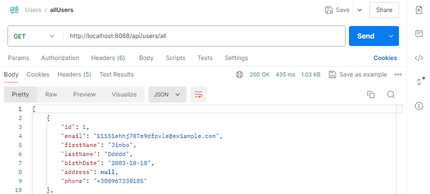
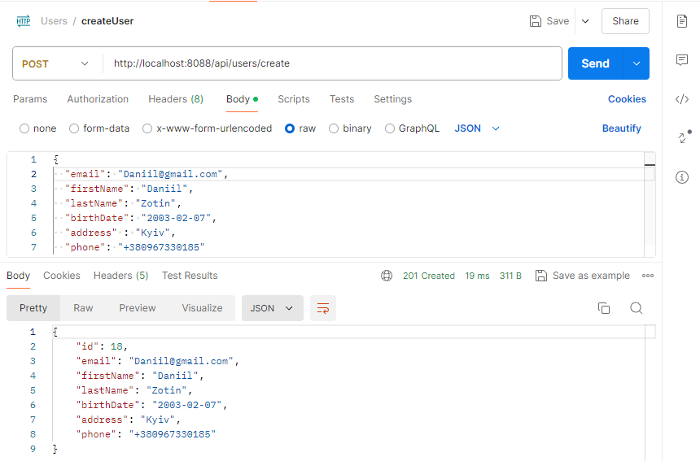
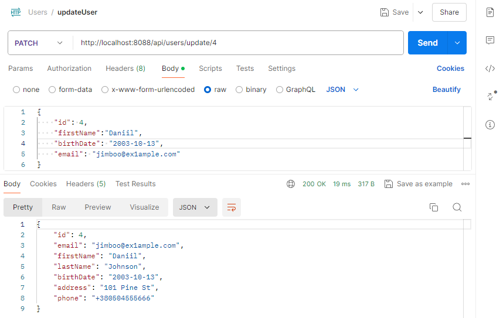
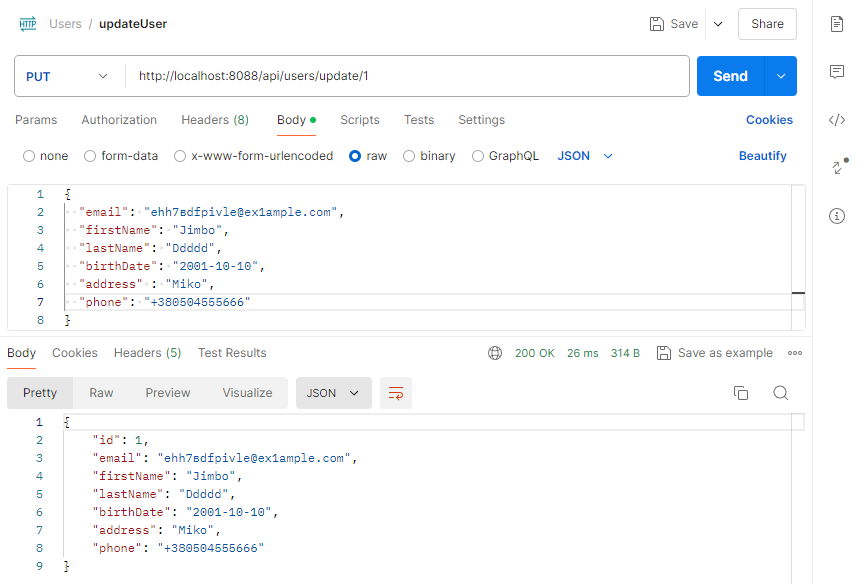
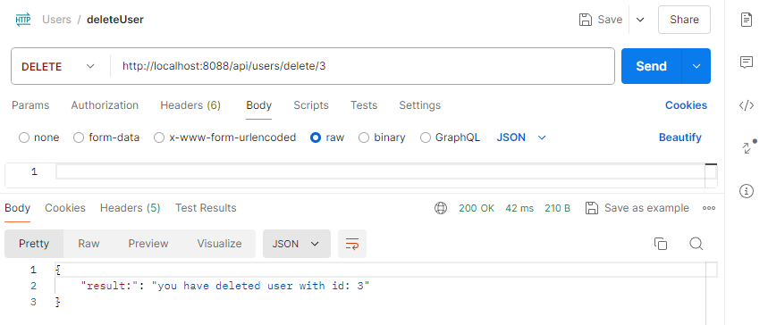
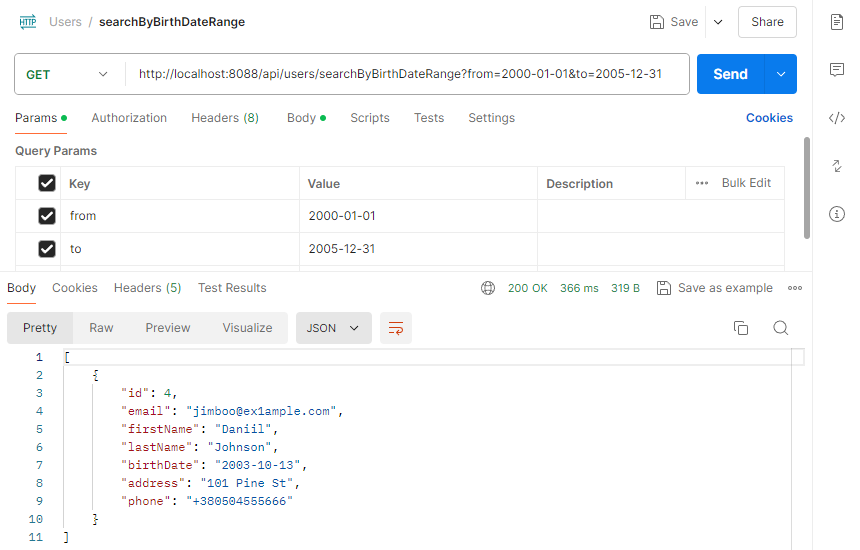
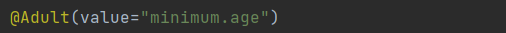
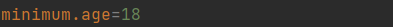
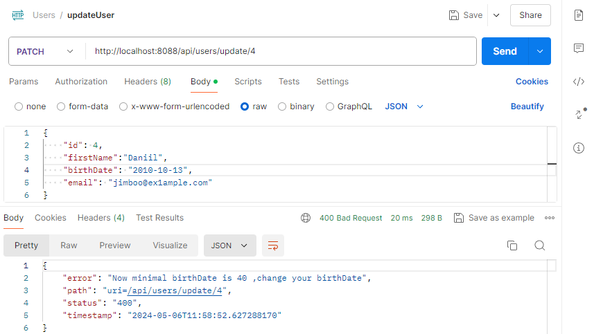
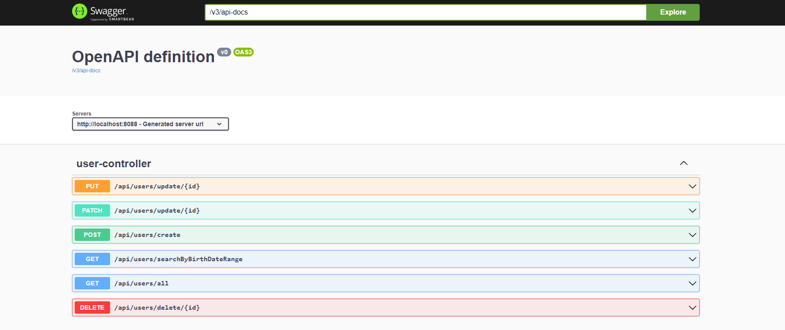

<br />
<div align="center">
  <a href="https://github.com/DaniilZotin/Spring-users-system">
    
  </a>

<h3 align="center" >Spring users system</h3>

</div>

## Introduction
Hi, my name is Daniil I am a developer specializing in Java and Java EE design
and development for one year. I have experience in
creating new projects and supporting existing ones. 

## About the project
A system for working with users that has the following endpoints:

1. $\color{#55AE5B}{{GET}}$ /api/users/all - Show all customers in the system
2. $\color{#E3C678}{{POST}}$ /api/users/create - Create user (years validation)
3. $\color{#7A4CB4}{{PATCH}}$ /api/users/update/{id} -  Update one/some user fields
4. $\color{#706CD4}{{PUT}}$ /api/users/update/{id}- Update user with all fields
5. $\color{#FF0000}{{DELETE}}$ /api/users/delete/{id} - Delete user
6. $\color{#55AE5B}{{GET}}$ /api/users/searchByBirthDateRange?from=yyyy-mm-dd&to=yyyy-mm-dd - Search for users by birth date range.


## Build with
* [![Spring][Spring]][Spring-url]
* [![Docker][Docker]][Docker-url]
* [![OpenJDK][OpenJDK]][Docker-url]
* [![POSTGRESQL][POSTGRESQL]][POSTGRESQL-url]


## Preview
### Get all users


### Create user


### Update user (one/some fields)
I implemented the following logic: The user
cannot change the id because it can lead to data 
inconsistency. Therefore, the id in the url must match the id in the json, 
or user can do not write id in the body of request


### Update user (all fields)


### Delete user


### Search user by birthdate range 



## Moments that I want to clarify

### 1. @Adult annotation
I chose the approach according to which the developer will enter the name of the field from 
which he wants to transfer data from the properties 
file right next to the annotation (argument), and if he wants to change the path of the file, 
then for this he must 
change the settings inside the annotation.




### 2. About min years to register
If you change the minimum age in the file, then try to update the user, with birthDate, 
then we will get an error because the fields will validate again, so I did at least minimal processing of this error


however if we do not update years we will not get this exception, and the person will remain with their date of birth

## How to install ? 
### 1. Clone the repo
```sh
    https://github.com/DaniilZotin/Spring-users-system.git
```
### 2. Up Docker 
```sh
     docker-compose up --build
```
### 3. You can use port 8088 to check app


## Additional info
You can also use swagger to test
```sh
  http://localhost:8088/swagger-ui/index.html#/
```



[Spring]: https://img.shields.io/badge/Spring-6DB33F?style=for-the-badge&logo=spring&logoColor=white
[Spring-url]: https://spring.io/projects/spring-framework

[Docker]: https://img.shields.io/badge/Docker-2496ED?style=for-the-badge&logo=docker&logoColor=white
[Docker-url]: https://www.docker.com/

[OpenJDK]: https://img.shields.io/badge/OpenJDK-000000?style=for-the-badge&logo=openjdk&logoColor=white
[OpenJDK-url]: https://www.docker.com/

[POSTGRESQL]: https://img.shields.io/badge/postgresql-4169E1?style=for-the-badge&logo=postgresql&logoColor=white
[POSTGRESQL-url]: https://www.docker.com/
